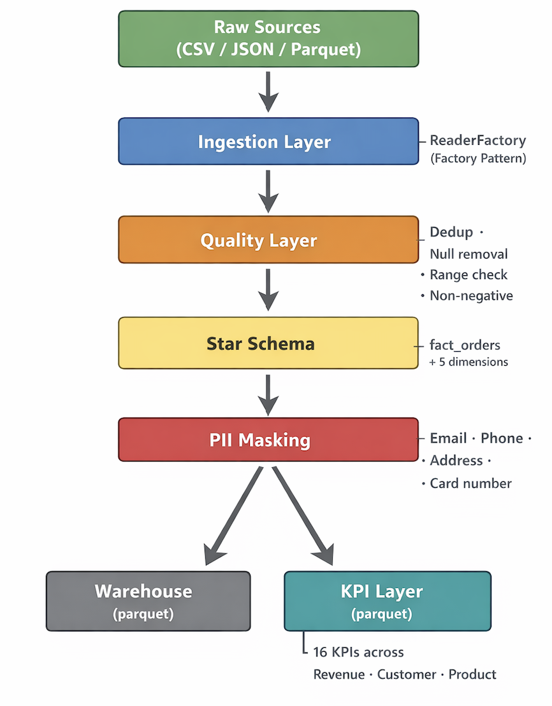

# Ecommerce Data Pipeline

A production-style PySpark data pipeline for ecommerce analytics. Reads from multiple source formats, applies data quality checks, builds a star schema data warehouse, masks PII, and computes 16 ecommerce KPIs.

---

## Architecture

